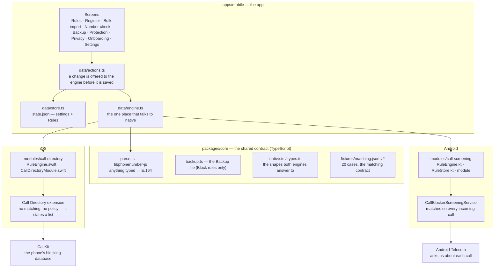
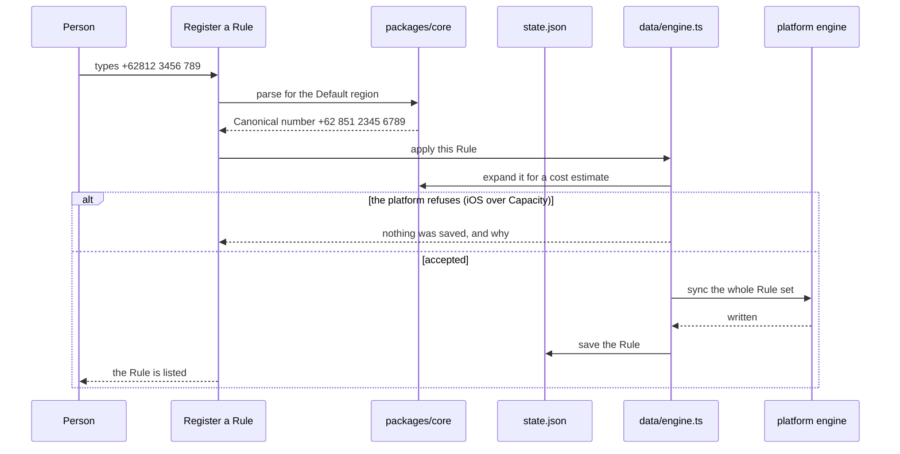
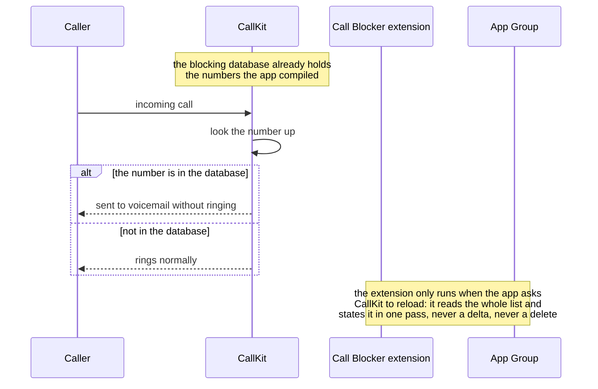
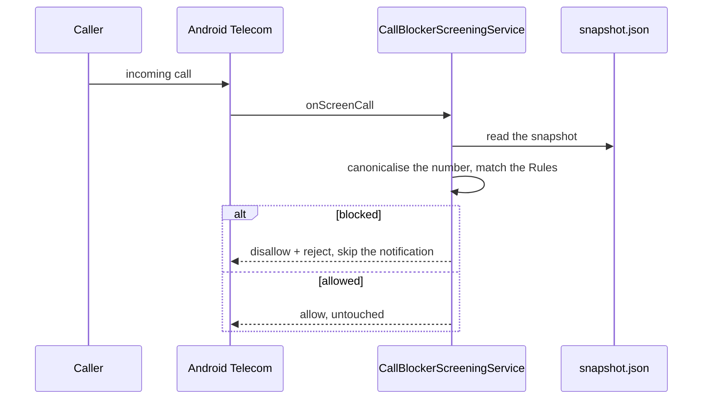
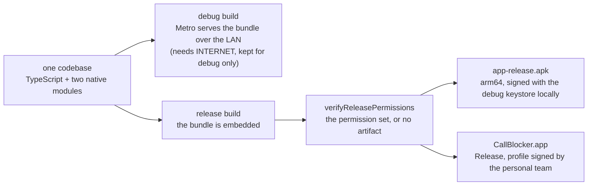

# How Call Blocker is put together

The map of the system: what the parts are, what flows between them, and where every byte lives. The diagrams are [Mermaid](https://mermaid.js.org/) — GitHub and VS Code render them; in a plain editor they are still readable text.

The one sentence version: **the app turns Rules into what the phone's own blocking machinery needs, and the phone does the blocking.** No server, no account, and on iOS not even a permission.

## 1. The two halves

| Half | What it does | Where it runs |
|---|---|---|
| **The app** | Parse what a person types into Canonical numbers, hold the Rules, compute what the platform needs, show the truth about whether blocking is in force | TypeScript, Expo SDK 57 / React Native, `apps/mobile` |
| **The platform piece** | Block (iOS) or allow (Android) a call as it arrives | Swift on iOS, Kotlin on Android, `modules/` |

Everything that is *policy* (which numbers, in what precedence, what a person sees) lives in the app. Everything that is *enforcement* lives in native code, because neither platform will run JavaScript when a call arrives (ADR 0003).

## 2. Components

Two things in that picture explain most of the product's behaviour:

- **The engine is duplicated on purpose** (Swift and Kotlin), so the contract between them is a checked-in table of cases, not a document: `fixtures/matching.json`, currently **version 2 with 20 cases**, run by the Kotlin unit tests on every JVM build and by the Swift runner on Mac builds. A change to one engine that the other does not share fails the table.
- **`data/engine.ts` is the only file that knows both platforms exist.** Screens never call native code; they call actions, which call the adapter, which picks `call-directory` or `call-screening` by `Platform.OS` (and an inert engine on the web, where the app still runs and says so).

## 3. The matching contract

Every decision any engine makes is one of five, in this order (this is the text at the top of `fixtures/matching.json`):

| # | Condition | Result |
|---|---|---|
| 1 | Blocking is off | `off` — allowed, and no Rule is consulted |
| 2 | A matching **Allow** rule | `rule` — allowed, whatever Block rule it overrides |
| 3 | A matching **Single number Block** rule | `rule` — blocked |
| 4 | Any other matching **Block** rule (Prefix, Interval) | `rule` — blocked |
| 5 | Nothing matches | `none` — allowed |

When several Block rules match, the most specific one reports: Single number first, then the first Prefix or Interval in input order. When several Allow rules match, the first in input order reports. "Reports" matters because Number check names the deciding Rule (`The Block rule +62 851 … decides this number`), and the indices it names are positions in the Rule list the engine was handed.

Allow beats Block at any size (ADR 0001). That is the whole precedence model now: with the Contacts allowance removed (ADR 0007), Allow rules are the only exception to a Block rule.

## 4. Data flow A — registering a Rule

Server this is not: the round trip is app memory → native engine → disk, all on the phone.

What "sync the whole Rule set" means differs by platform, and that difference is the most important thing to hold in your head about this codebase:

| | iOS | Android |
|---|---|---|
| What the engine is given | the Rules, with the country's dialled lengths per Prefix | the Rules, plain |
| What it computes | **the expanded flat list of numbers to block** — Prefixes and Intervals become every number they cover, minus Allow rules (ADR 0004 refuses a list past Capacity 25,000 rather than trimming) | nothing at sync time |
| What it persists | numbers + health records into the **App Group** (UserDefaults keys `blocked.json`, `meta.json`, `loaded.json`, `load.json`, `reload.json`) | the Rule snapshot into `files/call-screening/snapshot.json` |
| What the phone is told | `reloadExtension` — CallKit asks the extension to load | nothing; the service reads the snapshot per call |
| Where matching happens | at **sync** time, in the app | at **call** time, in the service |

So iOS spends its work once, up front, and the per-call path is a database lookup with no code of ours involved. Android spends nothing up front and matches the Rules on each call.

## 5. Data flow B — an incoming call

**iOS.** Nothing in this app runs. CallKit looks the number up in the blocking database the extension filled at its last load, and the extension's rules about *how* it fills that database are what make the answer stable:

The extension is deliberately dumb (its file comments say so at length): every request states the complete list, it never reads `isIncremental`, it never removes entries, it adds synchronously and completes in one pass, and it records what it did. That shape cannot go stale, which matters because a Call Directory extension fails silently otherwise — and it is the shape the working implementations on the App Store use (`docs/research/ios-call-blocking.md`).

**Android.** Our code runs on every call, because that is what the role means:

A blocked call is rejected and *stays in the system call log*, with no notification from us — the "no ring, no buzz" behaviour in the README. A call the service cannot identify (no parseable handle) is always allowed: the code refuses to block what it cannot name.

## 6. Data flow C — Number check and the engine self-check

`engine.checkNumber` hands one number to the **same** engine with the **same** Rule list, in-process, and returns the decision plus every Rule that matched. Nothing is written and no platform feature is touched, so a Number check answers "what would the engine do", which is exactly what the platform piece does at call time on Android and what the compiled list encodes on iOS.

The self-check (`Settings › Check the matching engine`) runs the 20-case fixture table on the device: it is the same file the JVM and Swift tests run, so "the engine agrees" means both implementations were asked the same questions in the same build.

## 7. Data flow D — Backup and Restore

A Backup file holds **Block rules only** — never Allow rules, never settings — because an Allow list is usually just someone's contacts copied out by hand (ADR 0002). Export writes `{ schemaVersion, exportedAt, rules }`; Restore offers Merge or Replace and says on its preview that the Allow list on the device is not touched. This is the only way data leaves the phone, it is started by the person, and it is a file they own.

## 8. Where every byte lives

| Data | iOS | Android |
|---|---|---|
| Rules, settings, onboarding flag | `Documents/call-blocker/state.json` in the app container | same path in the app's files |
| What the platform piece consumes | App Group `group.com.dwihp2.call-blocker`, UserDefaults keys: `blocked.json` (the numbers), `meta.json` (how many, when), `loaded.json` (what the extension last stated), `load.json` (started/finished/entries/failure), `reload.json` (what CallKit answered the last reload request) | `files/call-screening/snapshot.json` — blocking flag, Default region, Rules |
| The phone's blocking list | CallKit's own database, filled by the extension; not readable by the app | — (there is no list: the Rules are matched live) |

Nothing is written anywhere else. There is no cache directory, no database, no log file, and no network client in the app.

## 9. What the app asks the platform for

| | iOS | Android (release build) |
|---|---|---|
| Permissions | **none** — no usage descriptions at all | **`VIBRATE` alone** (a normal permission; nothing dangerous) |
| The thing that must be switched on | Settings › Phone › Call Blocking & Identification | the call-screening role |
| Who can switch it on | only the person | the person, through the system dialog the app opens |

The Android set is enforced at build time: `verifyReleasePermissions` in `apps/mobile/android/app/build.gradle` reads the packaged manifest and fails `assembleRelease`/`bundleRelease` unless it matches, so a dependency cannot quietly widen it (ADR 0006). The app shows the same list to the person under **Settings › Privacy**, read back from the platform — Android's requested permissions from the package manager, iOS's usage reasons from the app's own `Info.plist` — rather than from a list the app keeps. There is nothing to keep: the app has no contacts access (ADR 0007), no Internet permission in a release build, no analytics, and no server to talk to.

## 10. Build, release, and what "the frozen version" means

A release build needs no dev server: the JavaScript is inside the app, which is why the app works with the Mac asleep. Version and build numbers live in `apps/mobile/app.json` and are mirrored into the generated native projects (the iOS `Info.plist` pairs and the Android `build.gradle`); a version is "frozen" when the tag exists and the device pass recorded in `HANDOFF.md` was run for the platform it touches. The current frozen version is **0.2.0 (10)**, tagged `v0.2.0`.

## 11. Why the app sometimes rings anyway, and how you find out

Three failure modes are worth knowing, because they look identical from the outside (a call rings):

1. **The platform piece is off** — iOS turns the extension off on every install; Android's role can be revoked. Protection status says so, and the app now re-reads it whenever it returns to the front.
2. **The list was never loaded** — iOS fails silently if a request expires: entries are discarded and nothing tells the app. That is why every load is recorded (`load.json`) and why Protection reports "started … never reported finishing" rather than assuming success.
3. **The platform's own precedence wins** — on iOS a number in Contacts, or one with any record in Recents, out-ranks any third-party block list. This is CallKit, not the app (`docs/research/ios-call-blocking.md` §3d). Android has no equivalent: a blocked number is rejected outright.

Protection status is therefore assembled from what the platform answered — enabled status, the health records, the role — and not from what the app hoped. That is a product principle here, not a debugging aid: the app never claims calls are blocked when it cannot see that they are.

## 12. Reading list

| Document | What it answers |
|---|---|
| `CONTEXT.md` | the vocabulary: Rule, Pattern, Allow list, Effective block list, Capacity |
| `docs/adr/` | why each decision is what it is: precedent (0001), Backup scope (0002), native matching (0003), Capacity refusals (0004), Rule toggles (0005), the permission set (0006), no contacts (0007) |
| `docs/ios-lifecycle.md` | the iOS half in detail: Rule → App Group → extension → CallKit → lookup |
| `docs/research/ios-call-blocking.md` | the iOS investigation, fully sourced: what the SDK guarantees, what fails silently, what the device logs said |
| `HANDOFF.md` | where the project is right now: what is verified, what is frozen, what remains |
